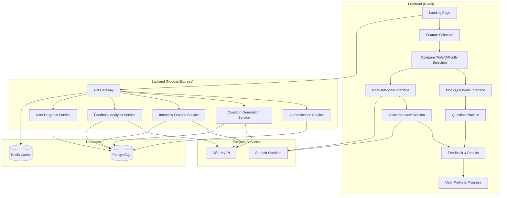

# Design Document

## Overview

Praxis is a full-stack web application built with a modern React frontend and Node.js backend, designed to provide two distinct interview preparation experiences: Mock Questions for text-based practice and Mock Interview for voice-based interactive sessions. The system leverages Web Speech API for voice interactions, AI/LLM integration for question generation and feedback, and a robust user management system for progress tracking.

## Architecture

### High-Level Architecture



### Technology Stack

**Frontend:**
- React 18 with TypeScript
- React Router for navigation
- Tailwind CSS for styling
- Web Speech API for voice interactions
- Axios for API communication
- React Query for state management and caching

**Backend:**
- Node.js with Express.js
- TypeScript for type safety
- JWT for authentication
- Prisma ORM for database operations
- Socket.io for real-time communication during interviews
- Rate limiting and security middleware

**Database:**
- PostgreSQL for persistent data
- Redis for session management and caching

**External Services:**
- OpenAI GPT-4 or similar LLM for question generation and feedback
- Web Speech API (browser-native) for speech-to-text and text-to-speech

## Components and Interfaces

### Frontend Components

#### Core Components
- **App.tsx**: Main application component with routing
- **AuthProvider**: Context provider for authentication state
- **ProtectedRoute**: Route wrapper for authenticated pages

#### Feature Components
- **FeatureSelector**: Landing component for choosing Mock Questions vs Mock Interview
- **CompanyRoleSelector**: Multi-step selector for company, role, and difficulty
- **MockQuestionsInterface**: Text-based question practice interface
- **MockInterviewInterface**: Voice-based interview session interface
- **FeedbackDisplay**: Results and feedback presentation
- **UserProfile**: Profile management and progress tracking

#### Shared Components
- **QuestionCard**: Reusable question display component
- **ProgressBar**: Session progress indicator
- **LoadingSpinner**: Loading state component
- **ErrorBoundary**: Error handling wrapper

### Backend API Endpoints

#### Authentication Endpoints
```typescript
POST /api/auth/register
POST /api/auth/login
POST /api/auth/logout
GET /api/auth/me
```

#### Content Endpoints
```typescript
GET /api/companies
GET /api/roles/:companyId
GET /api/questions/generate
POST /api/sessions/mock-questions
POST /api/sessions/mock-interview
```

#### User Management Endpoints
```typescript
GET /api/users/profile
PUT /api/users/profile
GET /api/users/progress
GET /api/users/sessions
```

#### Session Management Endpoints
```typescript
POST /api/sessions/start
PUT /api/sessions/:id/answer
POST /api/sessions/:id/complete
GET /api/sessions/:id/feedback
```

### Real-time Communication

#### Socket.io Events for Mock Interviews
```typescript
// Client to Server
'interview:start' - Initialize interview session
'interview:answer' - Submit voice answer
'interview:request_followup' - Request follow-up question

// Server to Client
'interview:question' - Send new question
'interview:followup' - Send follow-up question
'interview:feedback' - Send real-time feedback
'interview:complete' - End session
```

## Data Models

### User Model
```typescript
interface User {
  id: string;
  email: string;
  name: string;
  passwordHash: string;
  preferences: {
    preferredCompanies: string[];
    preferredRoles: string[];
    defaultDifficulty: 'easy' | 'medium' | 'hard';
  };
  createdAt: Date;
  updatedAt: Date;
}
```

### Company Model
```typescript
interface Company {
  id: string;
  name: string;
  description: string;
  logoUrl?: string;
  interviewStyle: string;
  availableRoles: Role[];
  createdAt: Date;
}
```

### Role Model
```typescript
interface Role {
  id: string;
  name: string;
  description: string;
  companyId: string;
  questionCategories: string[];
}
```

### Question Model
```typescript
interface Question {
  id: string;
  content: string;
  category: string;
  difficulty: 'easy' | 'medium' | 'hard';
  companyId: string;
  roleId: string;
  expectedAnswerPoints: string[];
  followUpQuestions?: string[];
}
```

### Session Model
```typescript
interface Session {
  id: string;
  userId: string;
  type: 'mock_questions' | 'mock_interview';
  companyId: string;
  roleId: string;
  difficulty: 'easy' | 'medium' | 'hard';
  status: 'active' | 'completed' | 'abandoned';
  questions: SessionQuestion[];
  startedAt: Date;
  completedAt?: Date;
  overallScore?: number;
  feedback?: SessionFeedback;
}
```

### Session Question Model
```typescript
interface SessionQuestion {
  id: string;
  sessionId: string;
  questionId: string;
  question: Question;
  userAnswer: string;
  answerTimestamp: Date;
  responseTime: number; // in seconds
  hesitationCount: number;
  followUpQuestions: FollowUpQuestion[];
  score?: number;
}
```

### Follow-up Question Model
```typescript
interface FollowUpQuestion {
  id: string;
  sessionQuestionId: string;
  content: string;
  reason: 'hesitation' | 'incomplete' | 'clarification' | 'depth';
  userAnswer?: string;
  timestamp: Date;
}
```

### Session Feedback Model
```typescript
interface SessionFeedback {
  id: string;
  sessionId: string;
  overallScore: number;
  strengths: string[];
  improvements: string[];
  technicalAccuracy: number;
  communicationClarity: number;
  responseCompleteness: number;
  recommendedTopics: string[];
  detailedAnalysis: string;
}
```

## Error Handling

### Frontend Error Handling
- **Network Errors**: Retry mechanism with exponential backoff
- **Authentication Errors**: Automatic redirect to login
- **Validation Errors**: Real-time form validation with user-friendly messages
- **Speech API Errors**: Fallback to text input with clear error messages
- **Session Errors**: Graceful session recovery and state persistence

### Backend Error Handling
- **Input Validation**: Joi schema validation for all endpoints
- **Database Errors**: Transaction rollback and connection pooling
- **External API Errors**: Circuit breaker pattern for LLM API calls
- **Rate Limiting**: Graceful degradation with informative responses
- **Logging**: Structured logging with Winston for debugging and monitoring

### Error Response Format
```typescript
interface ErrorResponse {
  success: false;
  error: {
    code: string;
    message: string;
    details?: any;
  };
  timestamp: string;
}
```

## Testing Strategy

### Frontend Testing
- **Unit Tests**: Jest and React Testing Library for component testing
- **Integration Tests**: Testing user flows and API integration
- **E2E Tests**: Playwright for critical user journeys
- **Accessibility Tests**: Automated a11y testing with jest-axe
- **Speech API Mocking**: Mock Web Speech API for consistent testing

### Backend Testing
- **Unit Tests**: Jest for service and utility function testing
- **Integration Tests**: Supertest for API endpoint testing
- **Database Tests**: In-memory PostgreSQL for isolated testing
- **Load Tests**: Artillery for performance testing
- **Security Tests**: OWASP ZAP for vulnerability scanning

### Test Coverage Goals
- Minimum 80% code coverage for both frontend and backend
- 100% coverage for critical paths (authentication, payment, data integrity)
- Performance benchmarks for speech processing and question generation

### Testing Environments
- **Development**: Local testing with mocked external services
- **Staging**: Full integration testing with production-like data
- **Production**: Monitoring and alerting for real-time issue detection

## Security Considerations

### Authentication & Authorization
- JWT tokens with short expiration and refresh token rotation
- Password hashing with bcrypt (minimum 12 rounds)
- Rate limiting on authentication endpoints
- Account lockout after failed attempts

### Data Protection
- Input sanitization and validation on all endpoints
- SQL injection prevention through parameterized queries
- XSS protection with Content Security Policy
- HTTPS enforcement in production

### Privacy & Compliance
- User data encryption at rest and in transit
- GDPR compliance for EU users
- Data retention policies for session recordings
- User consent management for voice data processing

### API Security
- API key management for external services
- Request signing for sensitive operations
- CORS configuration for frontend domains
- Rate limiting per user and IP address